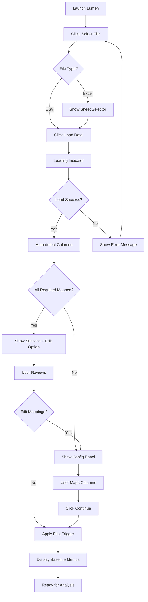
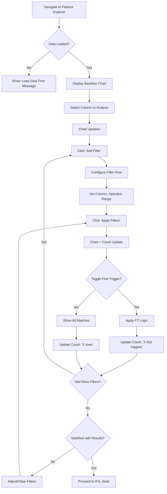
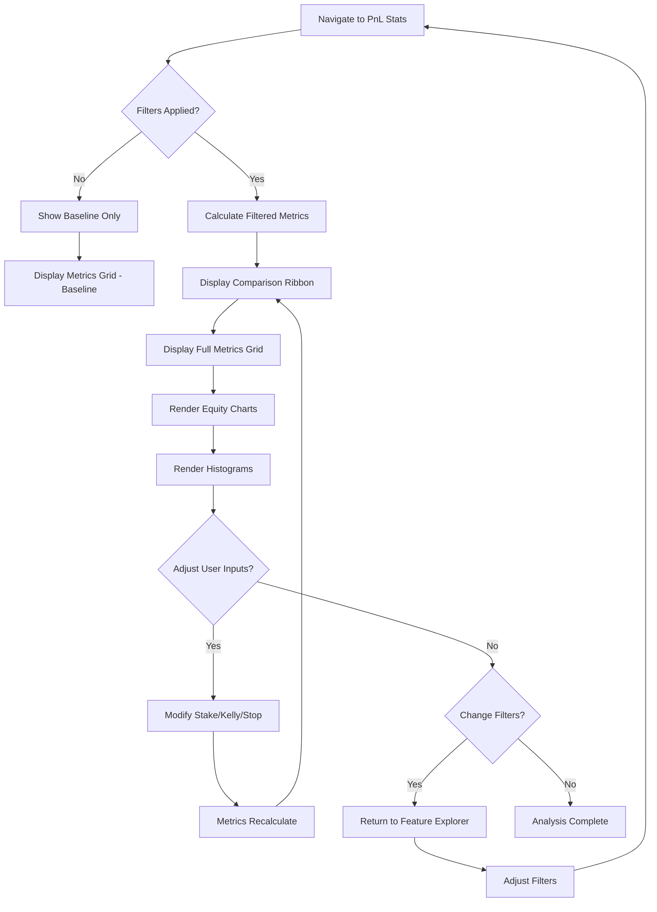
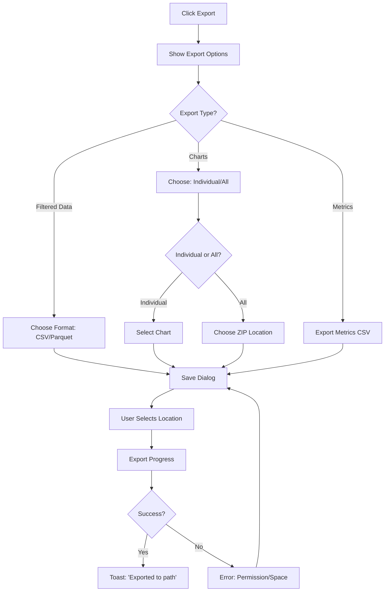

# Lumen UI/UX Specification

**Version:** 1.0
**Date:** 2026-01-09
**Author:** Sally (UX Expert Agent)
**Status:** Ready for Development

---

## Table of Contents

1. [Introduction](#1-introduction)
2. [Overall UX Goals & Principles](#2-overall-ux-goals--principles)
3. [Information Architecture](#3-information-architecture)
4. [User Flows](#4-user-flows)
5. [Wireframes & Mockups](#5-wireframes--mockups)
6. [Component Library / Design System](#6-component-library--design-system)
7. [Branding & Style Guide](#7-branding--style-guide)
8. [Accessibility Requirements](#8-accessibility-requirements)
9. [Responsiveness Strategy](#9-responsiveness-strategy)
10. [Animation & Micro-interactions](#10-animation--micro-interactions)
11. [Performance Considerations](#11-performance-considerations)
12. [Next Steps](#12-next-steps)

---

## 1. Introduction

This document defines the user experience goals, information architecture, user flows, and visual design specifications for **Lumen**'s user interface. It serves as the foundation for visual design and frontend development, ensuring a cohesive and user-centered experience.

---

## 2. Overall UX Goals & Principles

### Target User Personas

**Power Trader (Primary):** Quantitative day traders who generate 10k-100k+ rows of historical trade data and need rapid hypothesis testing. Technically comfortable but not necessarily programmers. They value speed above all else and currently suffer through slow Excel workflows. They need to test multiple filter combinations per session and make data-driven position sizing decisions.

**Strategy Researcher (Secondary):** Hobbyist quants, students, or traders transitioning from discretionary to systematic approaches. Smaller datasets, more exploratory mindset. They want intuitive UI without coding and the ability to build intuition about their trading data through visual exploration.

### Usability Goals

1. **Ease of learning:** New users complete the full 4-tab workflow within their first session without documentation
2. **Efficiency of use:** Apply filters and see updated metrics in < 500ms; test 10x more hypotheses than Excel
3. **Error prevention:** Clear validation on file loads, column mappings auto-detected with manual override fallback
4. **Immediate feedback:** Every filter, toggle, or input yields visible response in < 500ms
5. **Memorability:** Tab-based linear workflow matches natural analysis progression

### Design Principles

1. **Speed as UX** — Every interaction yields sub-500ms feedback; perceived performance builds trust
2. **Always-on comparison** — Baseline metrics persist as reference; no context-switching required
3. **Explore, don't configure** — Sensible defaults minimize setup; progressive disclosure for power users
4. **Data as hero** — Chrome fades to background; numbers and charts dominate
5. **Dark precision** — Observatory-themed aesthetic conveys professional, scientific instrument

---

## 3. Information Architecture

### Site Map / Screen Inventory

```mermaid
graph TD
    A[Lumen Application] --> B[Tab 1: Data Input]
    A --> C[Tab 2: Feature Explorer]
    A --> D[Tab 3: PnL & Trading Stats]
    A --> E[Tab 4: Monte Carlo]

    B --> B1[File Selection]
    B --> B2[Sheet Selector]
    B --> B3[Column Configuration]
    B --> B4[Baseline Summary]

    C --> C1[Column Selector]
    C --> C2[Filter Controls]
    C --> C3[First-Trigger Toggle]
    C --> C4[Date Range Picker]
    C --> C5[Interactive Chart]
    C --> C6[Export Controls]

    D --> D1[User Inputs Panel]
    D --> D2[Comparison Ribbon]
    D --> D3[Metrics Grid]
    D --> D4[Flat Stake Chart]
    D --> D5[Kelly Chart]
    D --> D6[Distribution Histograms]

    E --> E1[Placeholder - Phase 3]
```



### Navigation Structure

**Primary Navigation:** Horizontal tab bar at top of window. Four tabs in fixed order representing the linear analysis workflow. Tabs cannot be reordered, closed, or hidden. Active tab indicated with nova-amber (#FFAA00) bottom border accent.

**Secondary Navigation:** None in MVP. Each tab is self-contained with no sub-navigation or drill-down views. All controls visible within the tab viewport.

**Breadcrumb Strategy:** Not applicable. The 4-tab structure is flat; users always know where they are by the active tab highlight. No nested views require breadcrumb trails.

### Navigation Flow

```
Data Input → Feature Explorer → PnL Stats → (Monte Carlo)
     ↓              ↓               ↓
  Load data    Apply filters    View results
     ↓              ↓               ↓
  See baseline  Toggle first-   Compare to
  metrics       trigger         baseline
```

---

## 4. User Flows

### Flow 1: Data Load & Configuration

**User Goal:** Load trading data file and establish baseline for analysis

**Entry Points:** Application launch, "Select File" button

**Success Criteria:** Baseline metrics displayed, all columns mapped correctly

#### Flow Diagram



#### Edge Cases & Error Handling
- **Corrupt file:** Show "Unable to read file. Please check the file format." with retry option
- **No numeric columns:** Show "No numeric columns found for analysis"
- **Missing required columns:** Block progress, highlight missing fields in config panel
- **Empty dataset:** Show "File contains no data rows"
- **Duplicate column mappings:** Prevent save, highlight conflict

**Notes:** Cache check happens before load dialog. If valid cache exists, offer "Load from cache (faster)" option.

---

### Flow 2: Filter & Explore Features

**User Goal:** Apply filters to find promising trade subsets

**Entry Points:** Feature Explorer tab, after data loaded

**Success Criteria:** Filtered dataset visible in chart, row count updated

#### Flow Diagram



#### Edge Cases & Error Handling
- **No matches:** Show "No rows match current filters" with suggestion to broaden criteria
- **Invalid range (min > max):** Inline validation, prevent apply
- **10 filter limit reached:** Disable "Add Filter", show tooltip explaining limit

**Notes:** First-trigger toggle remembers state across column changes. Date range filter persists independently of feature filters.

---

### Flow 3: Compare Metrics & Analyze

**User Goal:** Understand how filters impact trading performance vs baseline

**Entry Points:** PnL & Trading Stats tab, after filters applied

**Success Criteria:** All 25 metrics visible with baseline comparison and delta indicators

#### Flow Diagram



#### Edge Cases & Error Handling
- **Negative Kelly:** Show warning indicator, still display value
- **Blown account (Kelly):** Show "Account depleted at trade #X"
- **No winners/losers in filtered set:** Show "N/A" for relevant metrics
- **Single trade:** Calculate what's possible, show "Insufficient data" for streaks

**Notes:** Comparison Ribbon always visible at top. Scrolling metrics grid doesn't hide ribbon.

---

### Flow 4: Export Results

**User Goal:** Save analysis for records or further work

**Entry Points:** Export button (Feature Explorer bottom bar, PnL Stats)

**Success Criteria:** File saved to user-selected location

#### Flow Diagram



#### Edge Cases & Error Handling
- **No write permission:** "Cannot write to selected location. Choose another folder."
- **Disk full:** "Insufficient disk space for export"
- **File already exists:** Prompt overwrite confirmation

**Notes:** Suggested filename includes date and filter summary (e.g., `lumen_export_2026-01-09_filtered.csv`)

---

## 5. Wireframes & Mockups

### Primary Design Files

For MVP, detailed visual designs are described in this specification document rather than external design tools. The Observatory dark theme and component specifications provide sufficient guidance for PyQt6 implementation.

---

### Key Screen Layouts

#### Screen 1: Data Input Tab

**Purpose:** Enable users to load trading data, configure column mappings, and view baseline statistics

```
┌─────────────────────────────────────────────────────────────────────────┐
│  [Data Input]  [Feature Explorer]  [PnL Stats]  [Monte Carlo]           │
├─────────────────────────────────────────────────────────────────────────┤
│                                                                         │
│  ┌─────────────────────────────────┐  ┌──────────────────────────────┐ │
│  │  📁 Select File                 │  │  Load Status                 │ │
│  │  ─────────────────────────────  │  │  ✓ Loaded 83,421 rows       │ │
│  │  Path: trades_2025.xlsx         │  │    from trades_2025.xlsx     │ │
│  │  Sheet: [Sheet1 ▼]              │  │                              │ │
│  │                                 │  │  [Load Data]                 │ │
│  └─────────────────────────────────┘  └──────────────────────────────┘ │
│                                                                         │
│  ┌───────────────────────────────────────────────────────────────────┐ │
│  │  Column Configuration                              [Edit Mappings] │ │
│  │  ───────────────────────────────────────────────────────────────  │ │
│  │  ✓ Ticker: "Symbol"    ✓ Date: "Trade_Date"                       │ │
│  │  ✓ Time: "Time"        ✓ Gain %: "Return_Pct"                     │ │
│  │  ○ Win/Loss: (derived from Gain %)                                │ │
│  └───────────────────────────────────────────────────────────────────┘ │
│                                                                         │
│  ┌───────────────────────────────────────────────────────────────────┐ │
│  │  📊 Baseline: 12,847 first triggers from 83,421 total rows        │ │
│  │  ─────────────────────────────────────────────────────────────    │ │
│  │  ┌─────────┐ ┌─────────┐ ┌─────────┐ ┌─────────┐ ┌─────────┐     │ │
│  │  │ Trades  │ │Win Rate │ │ Avg Win │ │Avg Loss │ │   EV    │     │ │
│  │  │ 12,847  │ │  58.2%  │ │  3.21%  │ │ -2.14%  │ │  1.87%  │     │ │
│  │  └─────────┘ └─────────┘ └─────────┘ └─────────┘ └─────────┘     │ │
│  └───────────────────────────────────────────────────────────────────┘ │
│                                                                         │
└─────────────────────────────────────────────────────────────────────────┘
```

---

#### Screen 2: Feature Explorer Tab

**Purpose:** Interactive data exploration with filtering and visualization

```
┌─────────────────────────────────────────────────────────────────────────┐
│  [Data Input]  [Feature Explorer]  [PnL Stats]  [Monte Carlo]           │
├─────────────────────────────────────────────────────────────────────────┤
│ ┌──────────────────┐ ┌────────────────────────────────────────────────┐ │
│ │ Column           │ │                                                │ │
│ │ [% from VWAP ▼]  │ │                    •  •                        │ │
│ │                  │ │               •  •    •  •                     │ │
│ │ ── Filters ───── │ │            •    •  •      •  •                 │ │
│ │ [+ Add Filter]   │ │         •  •  •        •      •                │ │
│ │                  │ │       •      •    •  •    •      •             │ │
│ │ % from VWAP      │ │    •    •        •          •      •  •        │ │
│ │ BETWEEN          │ │  •  •      •  •      •  •          •           │ │
│ │ [5.0] - [15.0]   │ │    •  •  •      •        •    •  •             │ │
│ │              [×] │ │         •    •      •                          │ │
│ │                  │ │                                                │ │
│ │ [Apply Filters]  │ │           Interactive Scatter Chart            │ │
│ │ [Clear All]      │ │              (PyQtGraph)                       │ │
│ │                  │ │                                                │ │
│ │ ── Options ───── │ │                                                │ │
│ │ [■] First Trigger│ │                                                │ │
│ │     Only         │ │                                                │ │
│ │                  │ │                                                │ │
│ │ Date Range:      │ │                                                │ │
│ │ [2024-01-01]     │ │                                                │ │
│ │ [2025-12-31]     │ │                                                │ │
│ │ [✓] All Dates    │ │                                                │ │
│ └──────────────────┘ └────────────────────────────────────────────────┘ │
│ ┌───────────────────────────────────────────────────────────────────────┤
│ │ Showing 4,231 first triggers │ % from VWAP: 5-15  │ [Export CSV ▼]   │ │
│ └───────────────────────────────────────────────────────────────────────┘
└─────────────────────────────────────────────────────────────────────────┘
```

---

#### Screen 3: PnL & Trading Stats Tab

**Purpose:** Display all 25 metrics with baseline comparison, equity charts, and distributions

```
┌─────────────────────────────────────────────────────────────────────────┐
│  [Data Input]  [Feature Explorer]  [PnL Stats]  [Monte Carlo]           │
├─────────────────────────────────────────────────────────────────────────┤
│ ┌───────────────────────────────────────────────────────────────────┐   │
│ │   TRADES           WIN RATE          EV %            KELLY %      │   │
│ │    4,231            67.1%            3.21%           15.4%        │   │
│ │   ▼ 8,616 fewer    ▲ +8.9pp         ▲ +1.34pp       ▲ +3.3pp     │   │
│ │   vs 12,847        vs 58.2%         vs 1.87%        vs 12.1%     │   │
│ └───────────────────────────────────────────────────────────────────┘   │
│                                                                         │
│ ┌────────────────┐ ┌────────────────────────────────────────────────┐   │
│ │ User Inputs    │ │  Metrics Comparison                            │   │
│ │ ────────────── │ │  ──────────────────────────────────────────    │   │
│ │ Flat Stake $   │ │  Metric          Baseline   Filtered   Delta   │   │
│ │ [10,000]       │ │  ───────────────────────────────────────────   │   │
│ │                │ │  ▼ Core Statistics                             │   │
│ │ Start Capital  │ │  # of Trades     12,847     4,231      -8,616  │   │
│ │ [100,000]      │ │  Win Rate %      58.2%      67.1%      +8.9pp  │   │
│ │                │ │  Avg Winner %    3.21%      4.12%      +0.91pp │   │
│ │ Frac Kelly %   │ │  Avg Loser %     -2.14%     -1.89%     +0.25pp │   │
│ │ [25]           │ │  R:R Ratio       1.50       2.18       +0.68   │   │
│ │                │ │  ...                                           │   │
│ │ Stop Loss %    │ │  ▼ Flat Stake Metrics                          │   │
│ │ [2.0]          │ │  ▼ Kelly Metrics                               │   │
│ │                │ │  ▼ Distributions                               │   │
│ │ [Apply]        │ └────────────────────────────────────────────────┘   │
│ └────────────────┘                                                      │
│ ┌────────────────────────────────┐ ┌────────────────────────────────┐   │
│ │  Flat Stake Equity Curve       │ │  Kelly Equity Curve            │   │
│ │  ───────────────────────       │ │  ──────────────────            │   │
│ │     ──── Baseline              │ │     ──── Baseline              │   │
│ │     ──── Filtered              │ │     ──── Filtered              │   │
│ └────────────────────────────────┘ └────────────────────────────────┘   │
│ ┌────────────────────────────────┐ ┌────────────────────────────────┐   │
│ │  Winner Distribution           │ │  Loser Distribution            │   │
│ └────────────────────────────────┘ └────────────────────────────────┘   │
└─────────────────────────────────────────────────────────────────────────┘
```

---

#### Screen 4: Monte Carlo Tab (Placeholder)

**Purpose:** Indicate future functionality without cluttering MVP

```
┌─────────────────────────────────────────────────────────────────────────┐
│  [Data Input]  [Feature Explorer]  [PnL Stats]  [Monte Carlo]           │
├─────────────────────────────────────────────────────────────────────────┤
│                                                                         │
│                                                                         │
│                                                                         │
│                         ┌─────────────────────┐                         │
│                         │                     │                         │
│                         │   🎲 Monte Carlo    │                         │
│                         │                     │                         │
│                         │   Simulations       │                         │
│                         │   Coming in         │                         │
│                         │   Phase 3           │                         │
│                         │                     │                         │
│                         └─────────────────────┘                         │
│                                                                         │
│                                                                         │
│                                                                         │
└─────────────────────────────────────────────────────────────────────────┘
```

---

## 6. Component Library / Design System

### Design Philosophy: "Observatory Control"

**Conceptual Direction:** Lumen's interface channels the tension between **infinite cosmic scale** and **surgical precision**. Think: the control room at NASA's Jet Propulsion Laboratory meets a Tokyo trading floor at 3 AM. Data is sacred. Every pixel earns its place.

**Differentiator:** The interface should feel like piloting an instrument that can see through noise to truth. When users look at Lumen, they should feel *more capable* — like they've upgraded their analytical vision.

---

### Typography System

| Role | Font | Weight | Size | Character |
|------|------|--------|------|-----------|
| **KPI Display** | Azeret Mono | Bold | 42-56px | Cold precision, unflinching numbers |
| **Headers** | Geist | Bold/Medium | 18-28px | Clear authority |
| **Body/Labels** | Geist | Regular | 13-15px | Crystal clarity |
| **Data Values** | Azeret Mono | Medium | 13-16px | Monospace truth |
| **Captions** | Geist | Light | 11-12px | Whisper-quiet supporting info |

---

### Core Components

#### MetricCard

**Purpose:** Display a single metric value with label

**Variants:**
- `hero` — Comparison Ribbon (56px value, background glow)
- `standard` — Metrics grid (24px value, clean border)
- `compact` — Dense displays (16px value, minimal padding)

**States:**
- `positive` — Signal cyan left-edge glow
- `negative` — Signal coral left-edge glow
- `neutral` — No glow, text-medium delta

**Micro-interaction:** Number ticker on value change (150ms, ease-out-expo)

---

#### ComparisonRibbon (Signature Element)

**Purpose:** Display 4 key metrics with large numbers and deltas — Lumen's visual signature

**Visual Treatment:**
- Full-width, fixed position at top of PnL Stats tab
- Darker background (void-abyss) creates "sunken cockpit" effect
- Four hero MetricCards evenly distributed
- Bottom edge: 2px gradient line (cyan → amber → coral → blue)

---

#### FilterChip

**Purpose:** Display active filter criteria with remove action

**Format:** `{column}: {min} – {max}` (clear, readable)

**Visual:**
- Monospace text (Azeret Mono)
- 3px signal-amber left edge accent
- Dark background (bg-surface)

---

#### DataGrid

**Purpose:** Display tabular data (metrics comparison)

**Visual:**
- Alternating row backgrounds (subtle)
- Header: ALL CAPS, 10px, dimmed
- Numbers right-aligned, monospace
- Collapsible section headers

---

#### ToggleSwitch

**Purpose:** Binary on/off control (First Trigger toggle)

**States:**
- OFF: Track dust-gray, thumb moon-gray
- ON: Track signal-blue, thumb star-white, subtle pulse animation

---

#### ActionButton

**Hierarchy:**
- `primary` — Signal amber background, void-black text
- `secondary` — Transparent, signal-blue border
- `ghost` — Text only, underline on hover
- `danger` — Signal coral border

---

#### ChartCanvas

**Purpose:** Wrapper for PyQtGraph charts

**Visual:**
- Background: Pure void-black
- Grid: Barely visible, dashed
- Baseline series: Signal-blue, 40% opacity
- Filtered series: Signal-cyan, 100% opacity with glow

---

#### Toast

**Purpose:** Transient feedback messages

**Types:**
- `success` — Cyan left edge, ✓ icon
- `error` — Coral left edge, ✗ icon (persists until dismissed)
- `info` — Blue left edge, ℹ icon

---

## 7. Branding & Style Guide

### Visual Identity

**Brand Essence:**
- **Name Meaning:** "Lumen" = unit of luminous flux. Light that reveals truth in data.
- **Personality:** Precise, confident, quietly powerful. Not flashy — substantive.

---

### Color Palette

#### Backgrounds (4 Levels)

| Token | Name | Hex | Usage |
|-------|------|-----|-------|
| `--bg-base` | Void | `#0C0C12` | App background |
| `--bg-surface` | Surface | `#141420` | Panels, cards |
| `--bg-elevated` | Elevated | `#1E1E2C` | Hovers, tooltips |
| `--bg-border` | Border | `#2A2A3A` | All borders |

#### Signal Colors (Semantic — Inviolable)

| Token | Name | Hex | Meaning |
|-------|------|-----|---------|
| `--signal-cyan` | Cyan | `#00FFD4` | **Always positive** |
| `--signal-coral` | Coral | `#FF4757` | **Always negative** |
| `--signal-amber` | Amber | `#FFAA00` | **Always attention** |
| `--signal-blue` | Blue | `#4A9EFF` | **Always reference** |

#### Text Colors

| Token | Hex | Usage |
|-------|-----|-------|
| `--text-primary` | `#F4F4F8` | Headlines, values |
| `--text-secondary` | `#9898A8` | Labels, descriptions |
| `--text-disabled` | `#5C5C6C` | Disabled, placeholders |
| `--text-ghost` | `#3C3C48` | Grid lines, hints |

---

### Typography

#### Font Families

| Role | Font | Fallback |
|------|------|----------|
| **Data/Display** | Azeret Mono | SF Mono, Consolas, monospace |
| **UI** | Geist | SF Pro Text, Segoe UI, sans-serif |

#### Type Scale

| Element | Font | Size | Weight |
|---------|------|------|--------|
| KPI Hero | Azeret Mono | 48px | Bold |
| KPI Large | Azeret Mono | 32px | Bold |
| KPI Standard | Azeret Mono | 20px | Medium |
| H1 | Geist | 24px | Bold |
| H2 | Geist | 18px | Medium |
| Body | Geist | 13px | Regular |
| Table Data | Azeret Mono | 13px | Regular |

---

### Iconography

**Library:** Phosphor Icons (Regular weight)

**Core Set:** folder-open, upload-simple, check, x, warning, caret-up, caret-down, arrow-square-out, chart-line, funnel, gear

---

### Spacing System

**Base:** 4px

| Token | Value |
|-------|-------|
| `--space-1` | 4px |
| `--space-2` | 8px |
| `--space-3` | 12px |
| `--space-4` | 16px |
| `--space-6` | 24px |
| `--space-8` | 32px |

---

## 8. Accessibility Requirements

### Compliance Target

**Standard:** None (MVP) — Personal-use tool. Foundations built for future compliance.

### Key Requirements

**Color Contrast (Verified):**
- Primary text on base: 15.5:1 ✓
- Signal cyan on base: 12.3:1 ✓
- Signal coral on base: 5.2:1 ✓ (use for indicators, not small text)

**Color Independence:**
- Positive/negative use ▲/▼ direction indicators + color
- Delta values include +/- sign in addition to color

**Keyboard Navigation:**
- All functionality accessible via keyboard
- Tab navigation, arrow keys for lists
- Visible focus ring (signal-amber)

**Error Text Convention:**
Error messages use `--text-primary` for readability. Signal coral reserved for icons and borders, not body text at small sizes.

---

## 9. Responsiveness Strategy

### Window Size Handling

| Scenario | Width | Behavior |
|----------|-------|----------|
| Minimum | 1280px | Hard minimum |
| Standard | 1280–1920px | Comfortable |
| Large | 1920–2560px | Charts expand |
| Ultra-wide | 2560px+ | **Full stretch** |

### Layout Specifications

#### Feature Explorer Tab
- **Sidebar:** Fixed 320px (min 280px, max 360px)
- **Chart area:** Fluid (100% − sidebar)

#### PnL & Trading Stats Tab
- **Comparison Ribbon:** Full width, fixed/sticky at top
- **Metrics grid:** Always 4-column
- **Charts:** Side-by-side, equal width

### Resize Behavior

Layout reflow is instant (no animation). Qt layout managers handle redistribution.

### DPI Scaling

All sizes in logical pixels. Qt6 handles physical pixel conversion automatically. Test at 100% and 150% scaling.

### Window State Persistence

Saved to `.lumen_cache/window_state.json`:
- Position, size, maximized state, last active tab
- Reset to center if saved position is off-screen

---

## 10. Animation & Micro-interactions

### Motion Principles

**Philosophy:** Speed is the delight. Motion serves function, not decoration.

| Principle | Description |
|-----------|-------------|
| Fast by default | 100-200ms for most interactions |
| Purposeful | Communicates state change |
| Consistent | Same action = same animation |
| Interruptible | User actions cancel animations |

---

### Key Animations

#### Number Ticker (Signature)

**Trigger:** Numeric value updates

| Property | Value |
|----------|-------|
| Duration | 150ms |
| Easing | ease-out-expo |
| Steps | 8-12 intermediate values |

---

#### Delta Sign-Flip Flash (Signature)

**Trigger:** Delta changes from negative → positive (or reverse)

| Property | Value |
|----------|-------|
| Duration | 200ms |
| Effect | Glow pulse (cyan for positive, coral for negative) |

---

#### Loading Skeleton + Shimmer (Signature)

**Trigger:** File load initiated

**Sequence:**
1. Skeleton cards appear instantly
2. Shimmer sweeps during load (1.5s loop)
3. Data arrives → shimmer stops → skeleton fades (100ms)
4. Real cards stagger in (50ms/card)

**Minimum duration:** 400ms (even if load completes faster)

---

#### Staggered Data Load

**Trigger:** Load complete

| Property | Value |
|----------|-------|
| Duration per card | 200ms |
| Stagger delay | 50ms between cards |
| Effect | Opacity 0→1 + translateY(8px→0) |

---

### Animation Timing Reference

| Animation | Duration | Easing |
|-----------|----------|--------|
| Number ticker | 150ms | ease-out-expo |
| Delta flash | 200ms | ease-out |
| Tab switch | 150ms | ease-out |
| Filter chip add | 150ms | ease-out-back |
| Filter chip remove | 150ms | ease-in |
| Hover states | 100ms | linear |
| Toast enter | 200ms | ease-out |
| Toast exit | 150ms | ease-in |
| Focus ring | 0ms | instant |

---

### What We're NOT Animating

| Element | Reason |
|---------|--------|
| Chart points | 83k points can't animate smoothly |
| Window resize | Qt handles natively |
| Bulk metrics | Too many; would be chaotic |

---

## 11. Performance Considerations

### Performance Goals

| Metric | Target |
|--------|--------|
| App Launch | < 2s to interactive |
| Data Load | < 3s for 100k rows |
| Filter Response | < 500ms |
| Chart Render | < 200ms for 83k points |
| Animation FPS | 60fps |
| Memory | < 500MB with 100k rows |

---

### Design Strategies

#### Perceived Performance

| Strategy | Implementation |
|----------|----------------|
| Immediate feedback | Loading indicator within 100ms |
| Skeleton loading | Placeholder before data |
| Minimum loading state | 400ms minimum (prevents jarring truncation) |
| Progressive disclosure | Baseline first, then filtered |

#### Visual Performance

| Strategy | Implementation |
|----------|----------------|
| 60fps target | Simplify animations if frames drop |
| No chart animation | Instant redraw for 83k points |
| Debounce inputs | 150ms before recalculation |

---

### Animation Performance Requirements

| Animation | Duration | Fallback if Janky |
|-----------|----------|-------------------|
| Number ticker | 150ms | Reduce steps to 4 |
| Delta flash | 200ms | Opacity fade only |
| Shimmer | 1.5s | Switch to pulse |
| Data stagger | 50ms/card | Reduce to 30ms |

**Rule:** If animation drops frames, degrade gracefully.

---

### Performance Anti-Patterns

| Anti-Pattern | Instead |
|--------------|---------|
| Recalculate everything | Invalidate only affected caches |
| Block UI during calculation | Background threads |
| Animate 83k points | Instant redraw |
| Ship janky animation | Degrade to simpler |
| Skip loading on fast loads | Enforce 400ms minimum |

---

## 12. Next Steps

### Immediate Actions

1. Review specification with stakeholders
2. Set up font assets (Azeret Mono, Geist)
3. Create PyQt6 theme stylesheet
4. Build component prototypes
5. Validate PyQtGraph integration
6. Create 100k-row test dataset
7. Implement loading sequence prototype

---

### Design Handoff Checklist

| Item | Status |
|------|--------|
| UX goals & principles | ✓ Complete |
| User personas | ✓ Complete |
| Information architecture | ✓ Complete |
| User flows | ✓ Complete |
| Screen layouts | ✓ Complete |
| Component library | ✓ Complete |
| Color palette | ✓ Complete |
| Typography | ✓ Complete |
| Accessibility | ✓ Complete |
| Responsiveness | ✓ Complete |
| Animations | ✓ Complete |
| Performance | ✓ Complete |

---

### Success Criteria

| Criteria | Validation |
|----------|------------|
| Observatory aesthetic recognizable | Screenshot test |
| Speed feels instantaneous | < 500ms filter response |
| Comparison Ribbon memorable | Users notice and understand |
| Number ticker creates "calculation" feel | Perceived as "working" |
| Loading sequence choreographed | Smooth, not jarring |
| No animation jank | 60fps maintained |
| Color semantics learned | Cyan/coral interpreted without thinking |

---

## Change Log

| Date | Version | Description | Author |
|------|---------|-------------|--------|
| 2026-01-09 | 1.0 | Initial specification | Sally (UX Expert) |

---

*Generated with BMAD-METHOD Front-End Spec Template v2.0*
